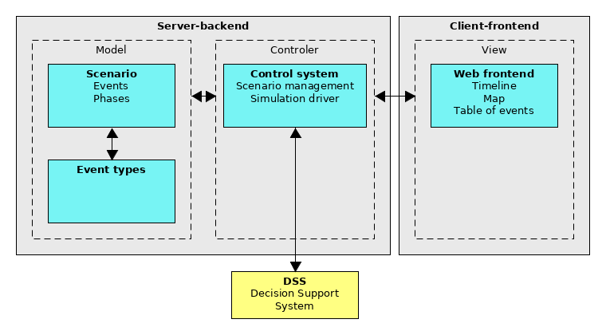
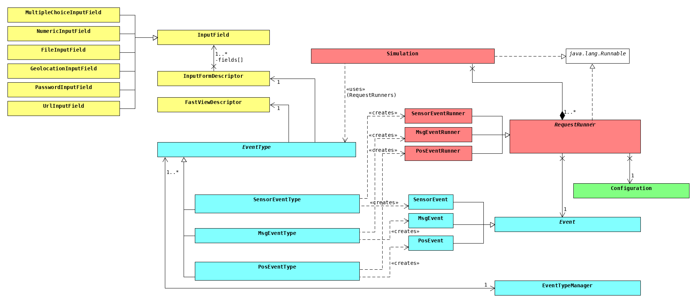

# Developer guide

---

<!-- TOC depthFrom:2 depthTo:6 withLinks:1 updateOnSave:1 orderedList:0 -->

- [Important note](#important-note)
- [Design ideas in *bePREPARED*](#design-ideas-in-beprepared)
	- [General structure](#general-structure)
	- [The backend](#the-backend)
		- [The main design problem](#the-main-design-problem)
		- [How we solved the design problem](#how-we-solved-the-design-problem)
		- [The important terminology in more detail](#the-important-terminology-in-more-detail)
			- [EventType](#eventtype)
			- [EventTypeManager](#eventtypemanager)
			- [RequestRunner](#requestrunner)
			- [ExecutionReport](#executionreport)
			- [InputFormDescriptor](#inputformdescriptor)
			- [InputField](#inputfield)
			- [FastViewDescriptor](#fastviewdescriptor)
		- [Other important concepts in the backend](#other-important-concepts-in-the-backend)
			- [JSON-representation of an event](#json-representation-of-an-event)
			- [The "data" JSON-object](#the-data-json-object)
- [How to write your own EventType](#how-to-write-your-own-eventtype)
	- [Important note:](#important-note)
	- [Step 1: Create all the needed class files](#step-1-create-all-the-needed-class-files)
	- [Step 2: Implementing those classes](#step-2-implementing-those-classes)
		- [Your custom event](#your-custom-event)
	- [Your custom EventType](#your-custom-eventtype)
	- [Your custom RequestRunner](#your-custom-requestrunner)
- [Step 3: Register your newly created EventType to the EventTypeManager](#step-3-register-your-newly-created-eventtype-to-the-eventtypemanager)

<!-- /TOC -->

---

## Important note

Before reading through this guide, read the [user guide](./userguide.md) first. This
guide should give you an insight in some of the design ideas behind *bePREPARED*. Also
you will learn how to extend *bePREPARED* with your own event types.

**It is highly recommended to read through the [design ideas](#design-ideas-in-beprepared)
section first before trying to change ANYTHING on the software!**

---

## Design ideas in *bePREPARED*

In this section we will talk about how the backend of *bePREPARED* is structured and what
the main ideas behind its design are. Once you understand these ideas, it should be easy
for you to extend *bePREPARED* as you wish.

### General structure

As you already know from the previous guides (that you really should have read by now),
*bePREPARED* consists of two parts: a web frontend and a JAVA-based backend. The idea
is that these two things roughly follow a "Model View Controller" (MVC) design, as
depicted in the following illustration:



Note that internally, frontend and backend follow their own, more specific MVC pattern.
Nethertheless, there are three consequences that you should see in this illustration:

1. All the application data is held by the backend; the frontend only holds a bit of
   it that is needed to visualize whats going on.
2. In order to keep the frontend and backend consistent, every bit of data that is
   entered by the user is first send to the backend and then relayed to the frontend if
   needed. **The frontend must not manage application data other then the bit of it that
   it needs to visualize events correctly. All data displayed in the frontend comes from
   the backend and is - if any - cached by the frontend.**
3. All the control logic is located in the backend. It contains the simulation driver
   that communicates with the DSS.

### The backend

We now have a closer look at the important part of the backend, that is depicted in the
following illustration:



This is - of course - a simplyfied version and an extract of the real class diagram.

#### The main design problem

The main problem when designing *bePREPARED* was that we could not know how an event
type would actually look like. *bePREPARED* should be extensible in order to work with
the most DSS and to provide as much freedom to future developers as possible when it
comes to extending and adapting the software for their own needs. So we had to provide
an interface that we can base the program on. The requirements on this interface were as
follows:

  - Provide a basic structure for an event that knows how to store the events data.
  - Provide a class "EventType" that contains a factory method for creating its specific
    events from raw data entered into the frontend.
  - Provide a functionality that makes it possible to extend *bePREPARED* only by editing
    the backend and without touching the frontend.

#### How we solved the design problem

Have a look at the extract of the class diagram again: The blue and red parts are how we
implemented the first and the second requirement. A specific EventType, like for instance
the "SensorEventType", is able to create a specific event, like the "SensorEvent".
Thereby *bePREPARED* does not need to know what data is actually held by a
"SensorEvent". It just treats it as a general "Event" returned by the "SensorEventType"'s
factory method. Furthermore, *bePREPARED* does not need to know how to perform the
event type specific request to whatever DSS. The EventType provides a so called
"RequestRunner", that, when triggered by the simulation, then performs the event type
specific request regarding the data stored in its assigned event and some general
settings stored in the global configuration.

Now have a look at the yellow part. This is our solution for the requirement of only
needing to edit the backend when extending *bePREPARED* with new custom event types.
Every event type has to provide a so called "InputFormDescriptor". It is a JAVA model of
the input form that should be displayed in the frontend. If you, for instance, want to
create a SensorEvent that takes a measured value as input, you add a NumericInputField
to the specific InputFormDescriptor's list of InputFields. The InputFormDescriptor of
each EventType are send to the web frontend on startup and resolved there to "real"
html code that is then displayed in the browser. A similar principle applies to the
"FastViewDescriptor", that describes the appearance of the small bubble that opens
up on mouse-hover over an event. The InputFields can also be used by the specific
EventType to request some input fields in the global configuration (green) that then can
be used by the specific RequestRunner.

#### The important terminology in more detail

##### EventType

The "EventType" is the implemented verion of an event type. It is implemented as an
interface in order to keep *bePREPARED* easily extensible. The "EventType" provides the
specific InputFormDescriptor and FastViewDescriptor. Furthermore, it can specify an
event type specific icon.

The name of an "EventType" is unique.

##### EventTypeManager

The "EventTypeManager" is used to obtain all avaiable "EventType"s. It is implemented as
a singleton. Every "EventType" has to be registered in the "EventTypeManager".

##### RequestRunner

The "RequestRunner" is the part of the software, that is actually resposible of
executing an event during the simulation, meaning, sending the corresponding request for
instance. Therefore, every "EventType" has to provide a specific "RequestRunner" for its
type of events.

The "RequestRunner" implements JAVA's own "Callable" interface, meaning that it returns
an "ExecutionReport" when finished running.

##### ExecutionReport

The "ExecutionReport" is the result of running a "RequestRunner". It contains
information on the execution of the latter. Besides the time of execution, the state of
execution ("normally" or "exceptionally") and a text representation of the
"RequestRunner" and its corresponding event the "ExecutionReport" also stores exceptions
if any.

At the end of a simulation, all "ExecutionReport"s are gathered together into a
simulation report that can be downloaded by the user for debuggin purposes.

##### InputFormDescriptor

For every "EventType" there has to be an "InputFormDescriptor" that describes the
appearance of the input form in the web frontend during creation or editing of an event
of a specific type. Besides the title of the input form the "InputFormDescriptor" also
contains a list of "InputField"s.

##### InputField

The "InputField" represents any input field in the web frontend's event editing or
event creation mask. For every "InputField" there have to be at least those properties
specified:
| Property name | Explanation |
| ------------: | :---------- |
| key   | The key corresponding to the value that'll be entered in this field. The key has to be unique.  |
| description | The label left of the input field. |
| tooltip | The tooltip. |
| defaultValue  | The default value of this input field (optional).  |

There exist some additional, more specific types of "InputField"s: The
"NumericInputField" for instance is can be used specifically to retrieve numbers from
the user. For an overview of what specific "InputField"s exist look at the package
```edu.kit.pse.beprepared.model.frontendDescriptors``` with corresponding JavaDoc.

##### FastViewDescriptor

The "FastViewDescriptor" describes the appearance of the "Fast View", meaning the little
popup that appears when hovering over an event. The "FastViewDescriptor" contains
information of the title and what values should be previewed to the user. In order to
achieve the latter a set of key-value pairs is used, where the key matches the one of
the corresponding "InputField" and the value is a short label that should be displayed
left of the actual value in the "FastViewDescriptor".

---

#### Other important concepts in the backend

##### JSON-representation of an event

Because *bePREPARED* should be easily extensible at any time there was the need of an
event-representation that works for any EventType and that can be used for storing and
transmitting events between frontend and backend. The following representation matches
those requirements. Each event is converted to a JSON-object with the following fields:

| Field name | Explanation |
| ---------: | :---------- |
| eventId  | The ID of the event or ```-1``` if no ID has been set yet.  |
| type  | The (unique) name of the EventType the event belongs to. It has to match the name used by the backend.  |
| pointInTime  | The (relative) point in time of the event.  |
| data  | A set of key-value-pairs containing the actual event specific data *(see below)*.  |

##### The "data" JSON-object

The key-value-pairs inside the "data"-field are composed as follows: The key is the same
that is used for the corresponding InputField the data has been entered in. The value is
the actual user input. If you have, for instance, an EventType that defines an
InputField with the key "message" in its InputFormDescriptor, the "data"-object inside
the JSON-representation of events of this type will have a key "message" as well.

Aside from these key-value-pairs, any data-object of any EventType contains one other
pair with the key "locations". The value that belongs to this key is another JSON-
object. If an EventType does not declare any ```GeolocationInputField```s inside its
InputFormDescriptor, the object corresponding to the "location"-key will be empty. If
there are such fields declared, the "locations-object" will contain key-value-pairs,
where the key matches the one of the "GeolocationInputField" and the value are the
coordinates entered by the user represented in the "GeoJSON"-format.

**Example 1**

Let's say we have a simple event that sends a message to a DSS-interface. This EventType
declares one single InputField in its InputFormDescriptor that has the key "message".
That'll lead to this JSON-representation:
```json
{
    "eventID": -1,
    "type": "Exampe Message Event",
    "pointInTime": 5000,
    "data": {
        "message": "Hello bePREPARED",
        "locations": {}
    }
}
```

**Example 2**

Let's look at a different EventType that declares the following InputFields: An
InputField "name", an InputField "description", a NumericInputField "thingID" and a
"GeolocationInputField" with the key "geo". That'll result in this JSON-representation:

```json
{
    "eventID": -1,
    "type": "Example Location Event",
    "pointInTime": 42000,
    "data": {
        "name": "Frauenhofer IOSB",
        "description": "Home of bePREPARED",
        "thingID": 1,
        "locations": {
            "geo": {
                "type": "Point",
                "coordinates": [
                    8.425644636154177,
                    49.01520384256359
                ]
            }
        }
    }
}
```

---

## How to write your own EventType

### Important note:

For those who don't have read through the stuff above this (what you should have done):
You do **not** want to touch anything from the frontend. You don't need to touch the
frontend in order to create you're own EventType.

If you are an unlucky person and you have to refactor the frontend we are very sorry for
you. That thing has been written by five guys who never did anything like this before;
nobody knew how to web-develop correctly. The frontend code looks exactly like this.

### Step 1: Create all the needed class files

First things first, it is recommended to create a new package for the new EventType
under ```edu.kit.pse.beprepared.eventTypes```. After that, you need to create three
JAVA-classfiles: The actual event, that extends ```Event```, the corresponding EventType
that exends ```EventType``` and last but not least the corresponding RequestRunner that
extends ```RequestRunner```.

### Step 2: Implementing those classes

#### Your custom event

When extending the class ```Event``` you are forced to create a suitable constructor
and to overwrite the method ```getData()```. The latter is used to create a map
containing all the key-value-pairs for the "data-JSON-object" we previously talked
about (and that's why you should have read the previous chapters). Keep in mind that
the keys must match the keys later used for the corresponding InputFields.

You should of course think about getters and setters as well.

### Your custom EventType

You have to implement four methods:
| Method name | Explanation |
| ----: | :--- |
| ```init()```  | This method initializes the name of the EventType, its icon, the InputForm- and FastViewDescriptor and (optionally) the InputFields that should appear in the global configuration. |
| ```createEvent(pointInTime, data)```  | This is the factory method for your custom event. It takes the user input from the frontend and creates the actual JAVA-object out of it. "data" is the previously discussed JSON-object respresented by a JAVA-Hashmap. |
| ```editEvent(pointInTime, data, event)```  | Edits a supplied event, so that its data matches the supplied data.  |
| ```getRequestRunnerFor(event, configuration)```  | Factory method for the custom RequestRUnner for your EventType. Takes the specific event and the global configuration as input.  |

### Your custom RequestRunner

Your RequestRunner needs a suitable constructor. Also, you have to overwrite the method
```call()``` that contains the behaviour that should be executed when this event is
triggered.

## Step 3: Register your newly created EventType to the EventTypeManager

Finally, you have to register your newly created EventType to the EventTypeManager. To
do so, you need to edit the EventTypeManager's constructor: Simply add a call of
```addEventType(...)``` with an object of your new EventType as a parameter.

**And that's it!** After you compiled and lauched the program, the new EventType should
be visible and working (at least from *bePREPARED*'s point of view).
