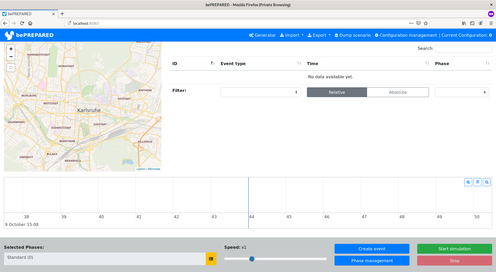
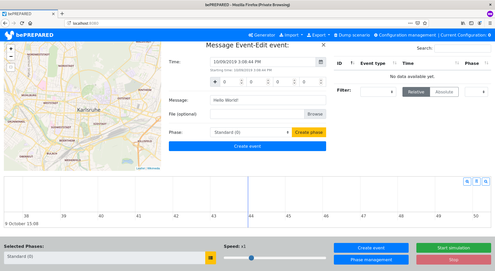
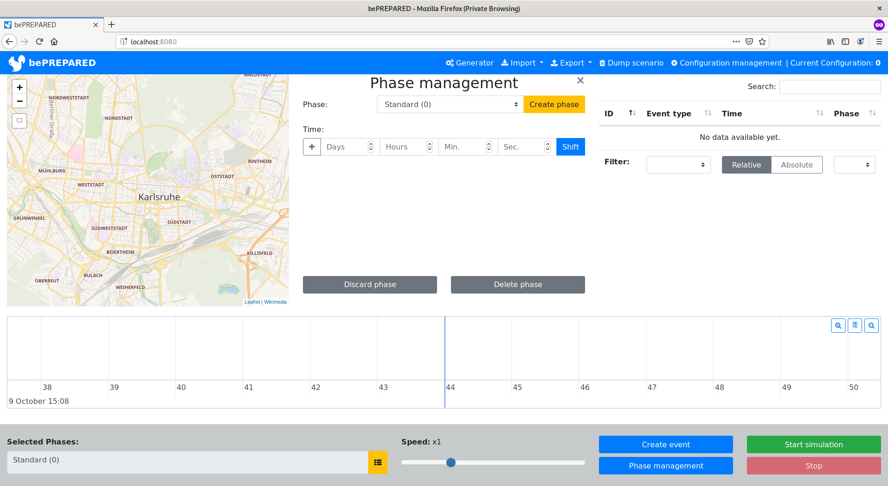
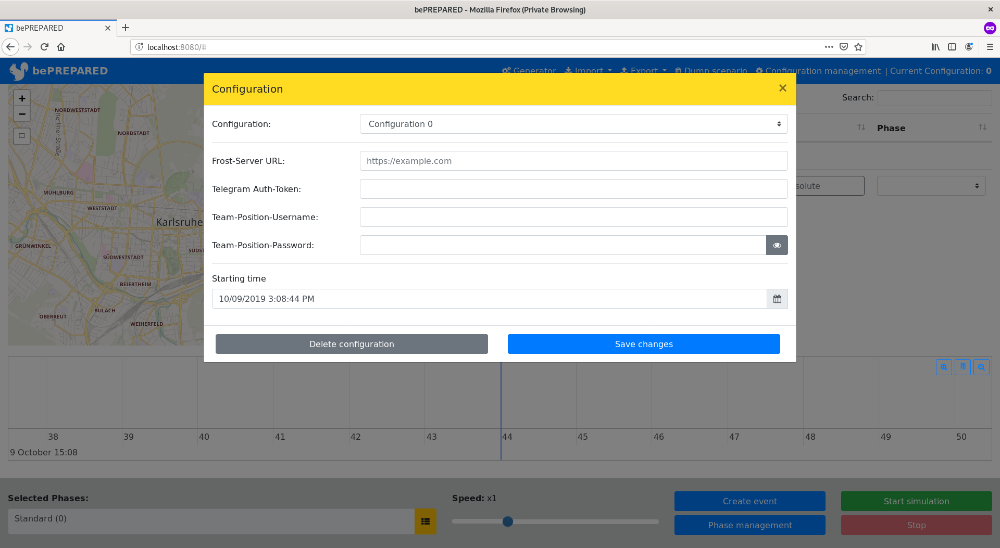

# User guide

---

<!-- TOC depthFrom:2 depthTo:6 withLinks:1 updateOnSave:1 orderedList:0 -->

- [Introduction](#introduction)
	- [Motivation](#motivation)
		- [Decision Support Systems (DSS)](#decision-support-systems-dss)
		- [What is *bePREPARED*?](#what-is-beprepared)
	- [Software description](#software-description)
		- [Important terminology](#important-terminology)
			- [Event](#event)
			- [Event type](#event-type)
			- [Phase](#phase)
			- [Scenario](#scenario)
			- [Configuration](#configuration)
- [Usage](#usage)
	- [Main view](#main-view)
	- [Creating/Editing events](#creatingediting-events)
	- [Controling the simulation](#controling-the-simulation)
	- [Phase management](#phase-management)
	- [Creating/Editing management](#creatingediting-management)
	- [Import and Export](#import-and-export)

<!-- /TOC -->

---

## Introduction

### Motivation

#### Decision Support Systems (DSS)

It is important to make far reaching decisions in a very short time in cases of disaster situation.
This decision has - of course - to be made in a way that all affected parties have the best outcome.
To make such a decision is often difficult for a decision maker because of the limited data he has
avaiable to him. To solve this problem, so called _"Decision Support Systems"_ (DSS) have been
developed. These systems gather, filter and (pre-) process data from lots of different sources like
sensors, social media, etc. and present them to the decision maker who is then  - hopefully - able to
make a "better" decision.

You realise that DSS are very powerful tools. And that might be a problem: What if the DSS processes
data in a wrong way or what if the decision maker does not know how to use the DSS properly and hence
missunderstands it? The importance of proper testing of the DSS and proper training of the decision
makers in advance of a disaster is beyond dispute. But the problem is: How can one conduct such a
test or training? In order to work, a DSS needs data. Without, it is just as useful as a stranded
boat. And that's where *bePREPARED* comes in.

#### What is *bePREPARED*?

*bePREPARED* is an event based simulation of a disaster situation. It has the ability to run a
detailed simulation of a disaster situation. *bePREPARED* is designed as a framework and therfore
it can be adjusted to all the different needs of different users and DSS.

### Software description

#### Important terminology

##### Event

An _event_ is the eventuation of a specific state over time. Every _event_ has a definite point in
time. This point in time is relative to the start point in time of a _scenario_. Therefore the point
in time of an _event_ can never be negative.

The general appearance of an _event_ is determined by the _event type_. The _event_ itself merely
stores specific data.

An _event_ is always assigned to one single _phase_.

##### Event type

The _event type_ defines the basic structure and appearance of an _event_. Hence, it is an abstraction
of a specific _event_.

##### Phase

A _phase_ is a series of _events_. It offers the possibility of cronologically or topically grouping
_events_ together.

A _phase_ starts with the first and ends with the last _event_ assigned to it. Therefore _phases_
can overlap each other. A _phase_ has a unique ID assigned to it by the system. In addition, the user
may give it a human readable label.

The amount of _events_ assigned to a single _phase_ is unlimited. Also, a _phase_ may be empty.

##### Scenario

A _scenario_ is a sequence of _phases_. It is the entirety of the modeled disaster situation.

A _scenario_ starts with the first and ends with the last assigned _event_. Every _scenario_ at every
time has at least one _phase_: The standard phase.

##### Configuration

In order to run a simulation, *bePREPARED* needs some further, event type specific configuration, e.g.
the IP-address of an DSS-interface. These settings are managed apart from the _scenario_ in a so
called _configuration_. This segregation allows a _scenario_ to be run with different _configuration_
on different DSS, for instance.

Despite the event type specific settings, every _configuration_ contains the start point of the
(absolute) scenario.

---

## Usage

**This part assumes that you have read through the introduction and  - most important - the
terminology section. If you have not done this, shame on you. And have fun trying to understand what
is talked about here.**

The software consists of two seperated parts: A web-frontend and a JAVA-based backend. In order to use
*bePREPARED* you have to start the backend first. You can do so by using an appropriate Docker-
Container or by compiling and then running the jar-archive.

### Main view

If no changes have been made, you can access the web frontend on port 8080 by default. It initializes
with an empty scenrio and an empty configuration and should look something like this:

The user interface contains three main elements: The map, the table of events and the event timeline.
They are used to display the particular events. The table of events and the timeline display every
event whereas the map only shows events that contain position data.

Besides the events, the timeline also displays the current point in time of the running simulation. If
no simulation is running, it displays the start point in time set in the current configuration.

### Creating/Editing events

You can create events using the appropriate button in the bottom right corner of the screen. In doing
so you have to choose the event type first. After that, an appropriate input dialog will open up that
is used to create new or configure existing events of the selected type. After its creation, the event
will show up in the table of events, the timeline and - as the case may be - on the map. By left-
clicking on the event marker on either the map or the timeline, or by left-clicking on the events
entry in the event table, you can open up the event edit input form again to make changes to the
existing event.

### Controling the simulation

When some events (and possibly phases) have been created, you can select the phases that should be
simulated using the yellow button in the bottom part of the screen on the left of the speed-slider.

By using the appropriate buttons in the bottom right corner, the simulation can be started and
stopped. After the simulation has come to an end, there will be a prompt whether an execution report
shall be downloaded or not. This report contains detailed information of the simulation of each event.
It is usually more interesting for developers and not for the user itself, so no further details are
addressed here.

### Phase management

In addition to the play, stop and create button, the bottom right corner also contains a button to
open up the phase management dialog. This dialog gives the user the ability to create new phases and
move, discard or delete existing ones.

Moving a phase means moving every single event assigned to it by a specified amount of time. However,
this is only possible if no event would have a relative point in time less than zero afterwards,
meaning if no event gets moved before the start point in time of the scenario set by the current
configuration.

Discarding a phase means deleting the phase itself but not the events assigned to it. Instead of being
deleted, the events are reassigned to the scenario's standard phase. Accordingly, deleting a phase
means deleting it with all the events assigned to it.

### Creating/Editing management

If you want to create or edit the current configuration or create a new one from scratch, you can open
up an appropriate dialog by left-clicking the button "Configuration management" in the top right
corner of the screen.

The current configuration can be selected via the dropdown-menu in the top part of this dialog. The
middle part of the configuration management dialog depends on the installed event types and may look
different in your version of the program. It is used to configure event type specific settings, like
the address of a DSS interface for instance. In the bottom part of the configuration management dialog
the user can select the start point in time for the scenario as well as saving or deleting the
selected configuration.

### Import and Export

Using the appropriate buttons on the right side of the topline, you can export of import scenarios
as well as configurations.
